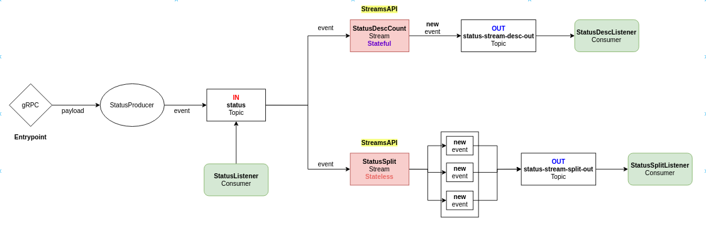

# hello-kafka

Project is created with:
* Micronaut
* Kotlin
* Kafka
* GRPC

## Kafka Flow

## Setup
To run this project:

Use Java11 with:
* sdkman: ``sdk install java 11.0.11.hs-adpt``
* sdkman: ``sdk use java 11.0.11.hs-adpt``

Build and run project with:
* Execute: ``docker-compose up -d``
* Execute: ``gradle clean build``
* Execute: ``gradle run``